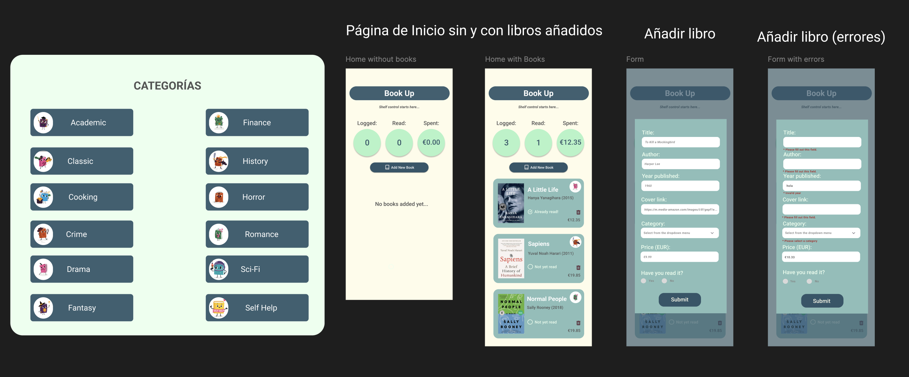
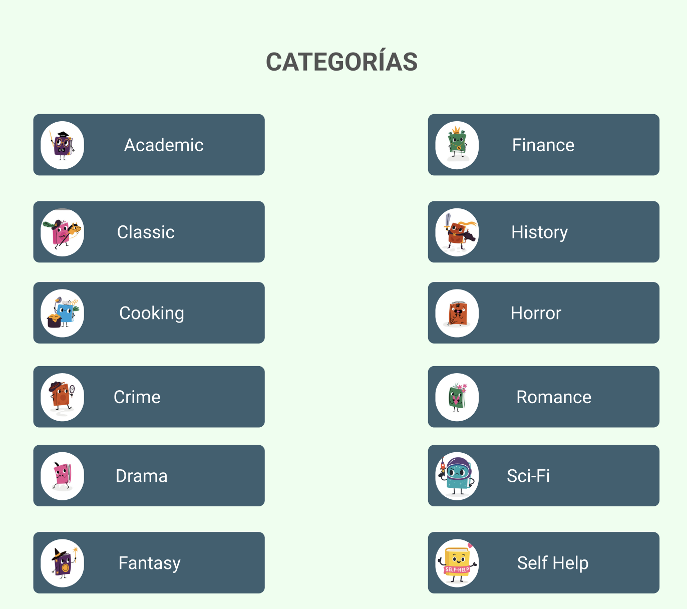
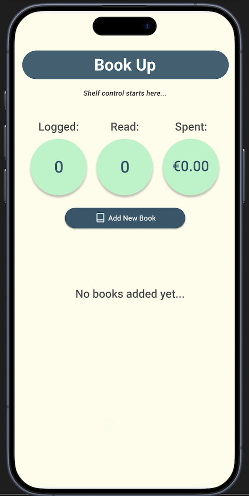
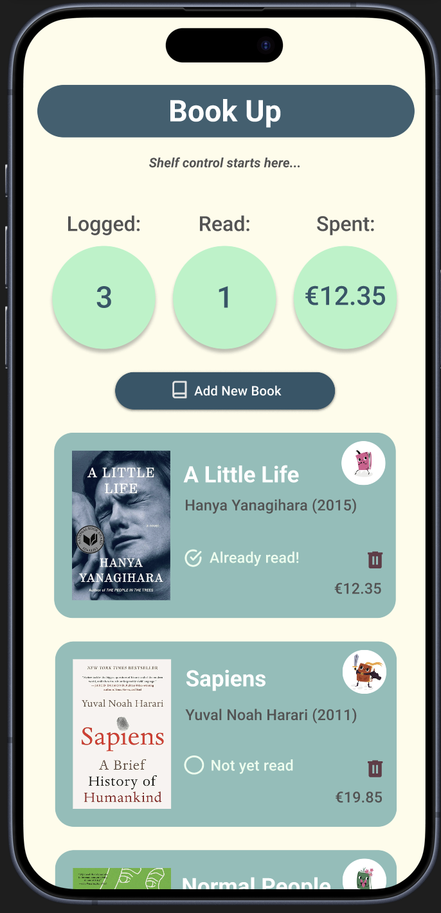
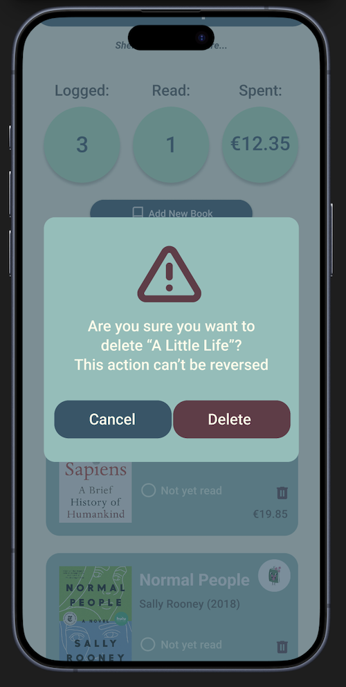
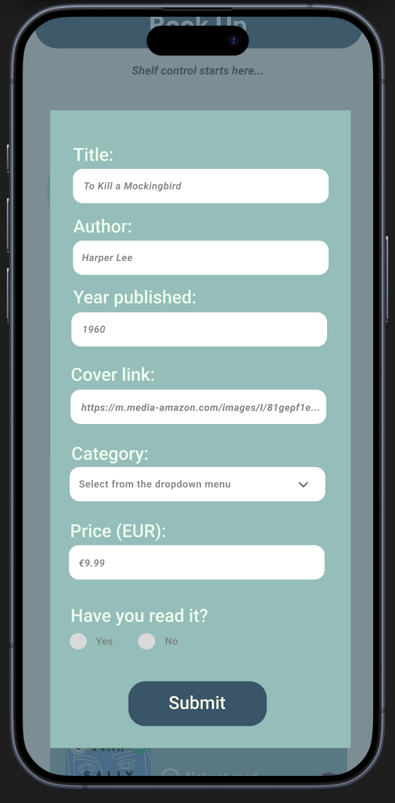
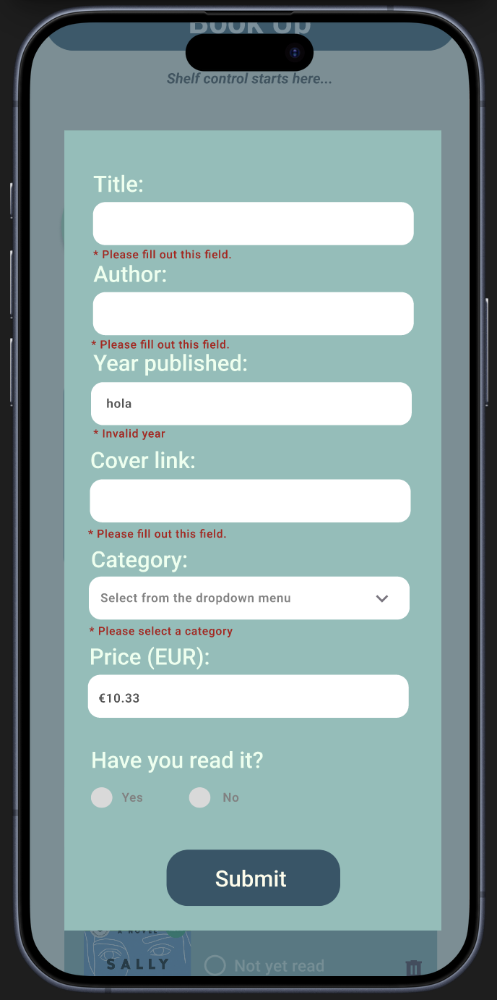

[< Volver al README](../README.md)

# Diseño de Pantallas en Figma

## Índice

1. [Enunciado de la actividad](#enunciado-de-la-actividad)
2. [Herramienta del diseño](#herramienta-del-diseño)
3. [Colores y tipografía](#colores-y-tipografía)
4. [Categorías](#categorías)
5. [Pantallas](#pantallas)
   - [Inicio (sin libros)](#inicio-sin-libros)
   - [Inicio (con libros)](#inicio-con-libros)
   - [Formulario de creación](#formulario-de-creación)
   - [Formulario con errores](#formulario-con-errores)

## Enunciado de la actividad:

```

Utilizando una herramienta como Excalidraw, diseña unas pantallas en las que:

• Muestres el listado de objetos, el número total de elementos de la lista, cuántos objetos hay marcados y el precio total que suman los marcados.

• Si la lista está vacía, debe mostrarse un mensaje informando al usuario y los contadores estarán a cero.

• Cada objeto listado mostrará su nombre, su precio, si está o no marcado y una imagen asociada a su categoría.

• Las categorías son fijas. Deberás decidir al menos cinco y buscar una imagen para cada una. Puedes añadir tantas categorías como consideres, pero debe quedar reflejado en el diseño.

• Piensa cómo vas a indicar si el objeto está marcado o no. El diseño de esto es completamente tuyo, no tiene por qué indicarse con palabras, puede ser un checkbox, colores, texto tachado, etc.

• Debe haber un botón que permita abrir un modal con un formulario. A través de este formulario, se podrá añadir un nuevo objeto con todos sus datos.

• Cada objeto debe tener algún mecanismo de eliminación individual.

```

## Herramienta del diseño

He utilizado `Figma` para diseñar las pantallas por su facilidad de uso, colaboración en tiempo real y acceso en la nube. Sus herramientas, como componentes reutilizables y prototipos interactivos, me han permitido crear un diseño profesional y organizado.

En Figma, además de mostrar el diseño, he incluido una pequeña simulación del comportamiento de la aplicación. Sin embargo, esta interacción no está muy desarrollada y solo sirve como una referencia básica.

[Puedes hacer click aquí para ver mi proyecto desde Figma](https://www.figma.com/design/2MlGG9b6yA65RGd8tVhQDG/PGL-MyList-Books?node-id=0-1&t=b8lN85pz6Ief0gXm-1)



## Colores y tipografía

Crear una `paleta de colores` es esencial para mantener la consistencia visual y la identidad de un proyecto. En este caso, la paleta define colores específicos para elementos clave como fondos, textos y estados (advertencias, resaltados, etc.):
| Nombre del color | Código HEX | Nombre asignado en el proyecto | Muestra de color |
| -------------------- | ---------- | ------------------------------ | ----------------------------------------------------------------------------------------------------------------- |
| Amarillo claro | `#FEFCEA` | Fondo principal |  |
| Verde azulado | `#8ABEB9` | Fondo secundario |  |
| Verde menta claro | `#AFF4C6` | Resaltado |  |
| Azul petróleo oscuro | `#305669` | Fondo botón |  |
| Gris oscuro | `#535353` | Texto primario |  |
| Blanco | `#FFFFFF` | Texto secundario |  |
| Verde pastel | `#EBFFEE` | Texto terciario |  |
| Granate oscuro | `#633B48` | Borrar |  |
| Rojo intenso | `#B51111` | Advertencia |  |

[Puedes hacer click aquí para ver el fichero de la paleta de colores](../src/theme/color.ts)

<br>

La elección de una tipografía adecuada es fundamental para garantizar la legibilidad y coherencia visual del diseño. En este proyecto, he optado por utilizar la fuente `Roboto` debido a su versatilidad, modernidad y amplia disponibilidad. Esta tipografía, con sus diversos tamaños y pesos, permite destacar elementos clave y mantener una jerarquía visual clara en las pantallas.

[Puedes hacer click aquí para ver el fichero de la tipografía](../src/theme/typography.ts)

## Categorías

Como se puede observar en el proyecto Figma, para la muestra de la categoría de cada libro se ha designado una imágen, concretamente una caricatura de un libro que refleja dicha categoría. Las imágenes y categorías son estas:



Todas estas representaciones fueron obtenidas [iStock](https://www.istockphoto.com/es/vector/personajes-de-libros-de-dibujos-animados-lindas-mascotas-de-publicaciones-de-gm1567007193-527625434), excepto Sci-Fi y Self Help, que fueron generados con OpenAI.

## Pantallas

| Pantalla                    | Descripción                                                                                                                                                                                                                                                                                                                                                                                                                                                                                                                                                                                                                   | Vista previa                                                              |
| --------------------------- | ----------------------------------------------------------------------------------------------------------------------------------------------------------------------------------------------------------------------------------------------------------------------------------------------------------------------------------------------------------------------------------------------------------------------------------------------------------------------------------------------------------------------------------------------------------------------------------------------------------------------------- | ------------------------------------------------------------------------- |
| **Inicio (sin libros)**     | Esta pantalla muestra el estado inicial de la aplicación cuando no hay libros en la lista. Incluye un mensaje informativo indicando que la lista está vacía y los contadores de elementos están en cero.                                                                                                                                                                                                                                                                                                                                                                                                                      |        |
| **Inicio (con libros)**     | En esta pantalla se presenta el listado de libros añadidos, junto con el número total de elementos, cuántos están marcados como leídos y el precio total de los leídos. Cada libro incluye su título, portada, autor, año de publicación, precio, estado (leído o no) y una imagen asociada a su categoría. La eliminación de un libro es posible clicando en el icono de la papelera. Se puede hacer scroll a la lista.                                                                                                                                                                                                      |       |
| **Eliminación de un libro** | Al pulsar en la papelera para eliminar un libro, se desplegará esta pequeña ventana de advertencia donde debe confirmarse su eliminación.                                                                                                                                                                                                                                                                                                                                                                                                                                                                                     |  |
| **Formulario de creación**  | El diseño de esta pantalla incluye un modal con un formulario para añadir un nuevo libro. El formulario permite ingresar todos los datos necesarios, como título, portada, autor, año de publicación, precio y categoría. Todos los campos son requeridos. Validaciones incluyen: <ul><li>Título y autor son campos libres de texto.</li><li>Año deberá ser un número menor a 2026.</li><li>La imagen es un enlace válido o se mostrará una por defecto.</li><li>La categoría se elige de un menú desplegable.</li><li>El precio debe seguir el formato de dinero.</li><li>El estado leído/no leído es obligatorio.</li></ul> |             |
| **Formulario con errores**  | Esta pantalla muestra el formulario de creación con validaciones activadas. Los errores se destacan visualmente para guiar al usuario en la corrección de los datos ingresados. Estos son sólo algunos de los errores que pueden ocurrir.                                                                                                                                                                                                                                                                                                                                                                                     |       |

<br>

[< Volver al README](../README.md)
