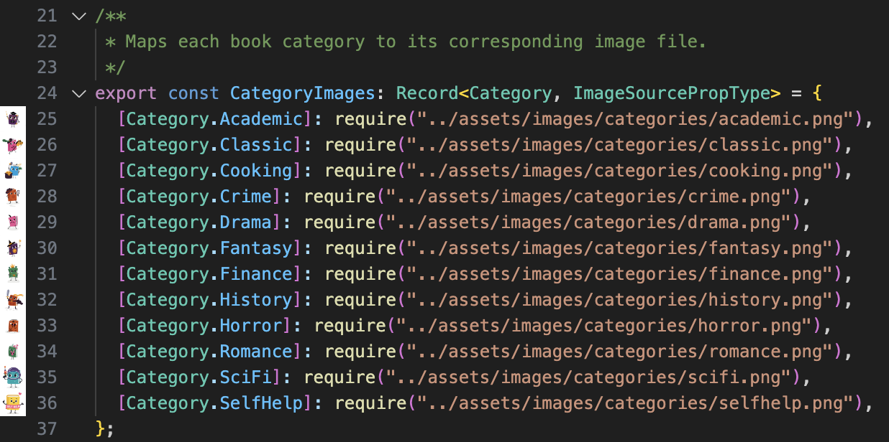
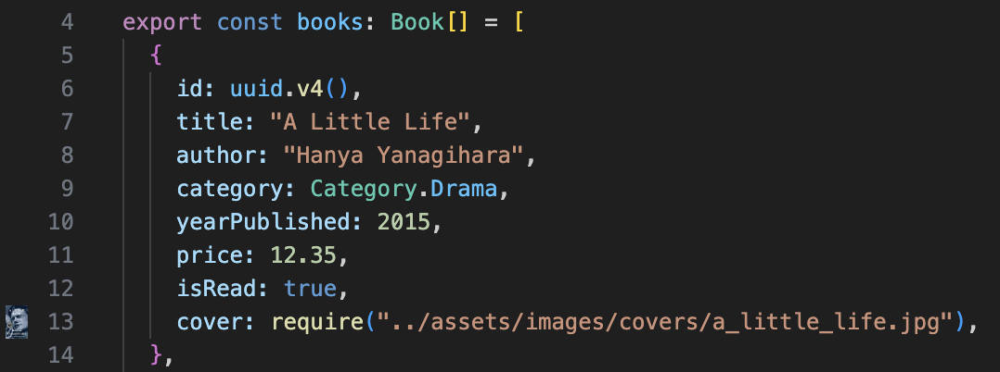

[< Volver al README](../README.md)

# Implementación de libros

## Índice

1. [Tipos de libro](#tipos-de-libro)
   - [Enum de Categorías](#enum-de-categorías)
   - [Mapeado de Categorías con sus imágenes](#mapeado-de-categorías-con-sus-imágenes)
   - [Interfaz Book](#interfaz-book)
2. [Datos mock](#datos-mock)
3. [Uso de BookContext](#uso-de-bookcontext)
4. [Componente `Book`](#componente-book)
5. [Componente `BookList`](#componente-booklist)

## Tipos de libro

En la aplicación, se han definido varios tipos para estructurar y organizar la información relacionada con los libros. Estos tipos son fundamentales para garantizar la consistencia de los datos y facilitar el desarrollo de componentes.

[Click aquí para visitar el fichero con el tipado en relación a los libros.](../src/types/book.ts)

A continuación, se describen los tipos principales:

### Enum de Categorías

El tipo `Category` es un enumerado (`enum`) que representa las diferentes categorías a las que un libro puede pertenecer. Esto permite clasificar los libros de manera clara y evitar errores al usar cadenas de texto arbitrarias. Las categorías disponibles incluyen:

- **Academic**
- **Classic**
- **Cooking**
- **Crime**
- **Drama**
- **Fantasy**
- **Finance**
- **History**
- **Horror**
- **Romance**
- **Sci-Fi**
- **Self-Help**

El uso de un enumerado asegura que las categorías sean predecibles y fáciles de manejar en el código.

### Mapeado de Categorías con sus imágenes

El objeto `CategoryImages` es un mapeo que asocia cada categoría con una imagen específica. Esto permite mostrar íconos o imágenes representativas para cada categoría, mejorando la experiencia visual de la aplicación. Por ejemplo, la categoría `Fantasy` está vinculada a una imagen temática de fantasía.

### Interfaz BookType

La interfaz `BookType` define la estructura de un objeto libro, asegurando que cada libro tenga las siguientes propiedades:

| Propiedad         | Validación                                                | Descripción                                                      |
| ----------------- | --------------------------------------------------------- | ---------------------------------------------------------------- |
| **id**            | Debe ser un identificador único                           | Se utiliza `react-native-uuid` para garantizar unicidad.         |
| **cover**         | Opcional, debe ser una URL válida o `null`                | Si no se proporciona, se muestra una imagen por defecto.         |
| **title**         | Obligatorio, cadena no vacía                              | El título debe ser una cadena de texto con al menos un carácter. |
| **author**        | Obligatorio, cadena no vacía                              | El autor debe ser una cadena de texto con al menos un carácter.  |
| **category**      | Obligatorio, debe ser un valor del enumerado `Category`   | Solo se permiten categorías predefinidas en el enumerado.        |
| **yearPublished** | Obligatorio, entero positivo menor o igual al año actual  | Validado con la función `isValidYear`.                           |
| **price**         | Obligatorio, número finito con un máximo de dos decimales | Validado con la función `isValidMoney`.                          |
| **isRead**        | Obligatorio, valor booleano                               | Indica si el libro ha sido leído (`true` o `false`).             |

Estas validaciones aseguran que los datos de los libros sean consistentes y cumplan con los requisitos de la aplicación, evitando errores y mejorando la experiencia del usuario.

Esta interfaz garantiza que todos los libros tengan una estructura consistente, lo que facilita su uso en los componentes y asegura que no falte información importante.

> **Nota:** La propiedad `cover` en la interfaz `Book` es opcional, lo que significa que no todos los libros necesitan tener una imagen de portada definida. En caso de que no se proporcione una portada válida, la aplicación mostrará una imagen por defecto. La imagen por defecto está diseñada para ser genérica y representativa, evitando espacios vacíos o elementos visuales incompletos.

En conjunto, estos tipos proporcionan una base sólida para manejar los datos de los libros en la aplicación, asegurando claridad, consistencia y facilidad de uso. Además, su diseño modular permite futuras extensiones o modificaciones sin afectar la funcionalidad existente.

## Datos mock

En el archivo `books.ts` [[click aquí para visitar]](../src/data/books.ts), se crearon datos mock para simular una lista de libros. Cada libro incluye información detallada como título, autor, categoría, año de publicación, precio, y si ha sido leído o no. Se utilizó la biblioteca `react-native-uuid` para generar identificadores únicos para cada libro, asegurando que cada elemento en la lista sea único. Además, se incluyeron imágenes de portada para cada libro, lo que mejora la experiencia visual en la aplicación.

Aquí muestro un pequeño ejemplo:

## Uso de BookContext

En la implementación final, se ha utilizado `BookContext` para centralizar la gestión de los libros. Esto permite que las funciones `addBook`, `deleteBook` y `toggleReadStatus` estén disponibles globalmente en toda la aplicación.

- **Ventajas del uso de `BookContext`**:
  - Centralización del estado de los libros.
  - Simplificación de la propagación de funciones entre componentes.
  - Mejor legibilidad y mantenimiento del código.

El contexto se define en el archivo `/context/BookContext.tsx` y proporciona las funciones necesarias para gestionar los libros. Los componentes `BookList` y `Book` acceden directamente al contexto para invocar estas funciones, eliminando la necesidad de pasarlas manualmente desde el componente `Home`.

## Componente `Book`

El componente `Book` es responsable de mostrar la información de un libro individual. Este componente recibe las propiedades de un libro gracias a la interfaz `BookProps`, la cual extiende `BookType`. En este componente mostramos un libro con un diseño atractivo, establecido en la [actividad 1](01-figma-design.md).

Incluye la portada del libro, el título, el autor, el año de publicación, el precio (formateado con dos decimales), y un indicador visual que muestra si el libro ha sido leído o no (así como la posibilidad de cambiar dicho valor, haciendo clic sobre el icono). Además, se utiliza una imagen en la esquina superior derecha para representar la categoría del libro, lo que mejora la claridad visual.

También se incluyó un ícono de eliminación para futuras funcionalidades, como eliminar un libro de la lista. [Para saber más sobre las interacciones con el libro haz clic aquí](03-book-interaction.md).

El diseño del componente se logró utilizando `StyleSheet` de React Native, asegurando consistencia en los estilos y una experiencia de usuario agradable.

> Para los iconos utilicé FontAwesome5 de @expo/vector-icons

[Visitar el componente Book.tsx](../src/components/Book.tsx)

## Componente `BookList`

El componente `BookList` es responsable de renderizar la lista completa de libros. Utiliza el componente `FlatList` de React Native para manejar listas de manera eficiente, incluso con grandes cantidades de datos. Cada elemento de la lista se renderiza utilizando el componente `Book`, lo que asegura consistencia en la presentación de los libros.

El componente `BookList` accede al `BookContext` para obtener la lista de libros y las funciones necesarias para gestionar la eliminación y el cambio de estado de lectura.

 

El uso de `FlatList` permite optimizar el rendimiento al renderizar solo los elementos visibles en pantalla, lo que es crucial para aplicaciones móviles. Además, se definió un estilo para el contenedor de la lista, asegurando que los libros se muestren correctamente alineados y con un espaciado adecuado.

En conjunto, estos componentes y datos proporcionan una base sólida para la funcionalidad de la aplicación, permitiendo una experiencia de usuario fluida y visualmente atractiva.

[< Volver al README](../README.md)
