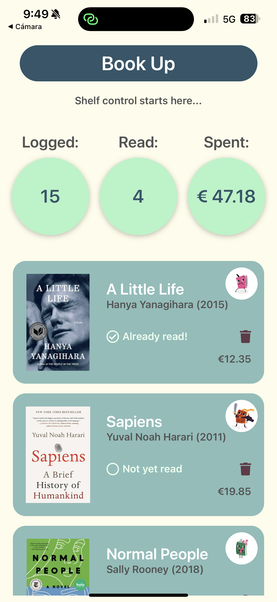
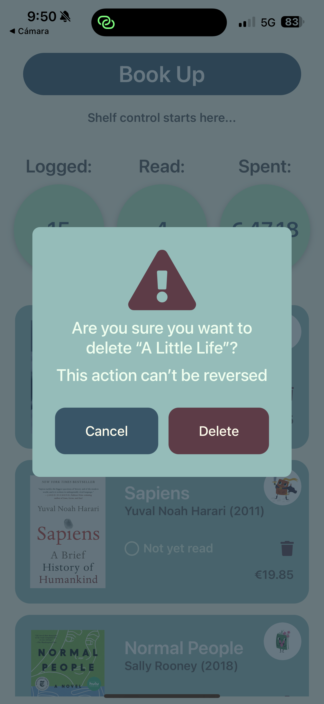
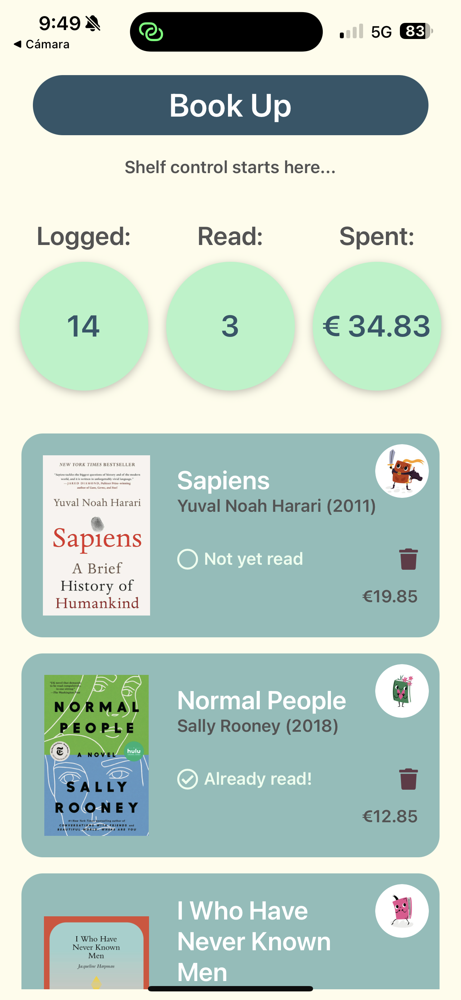
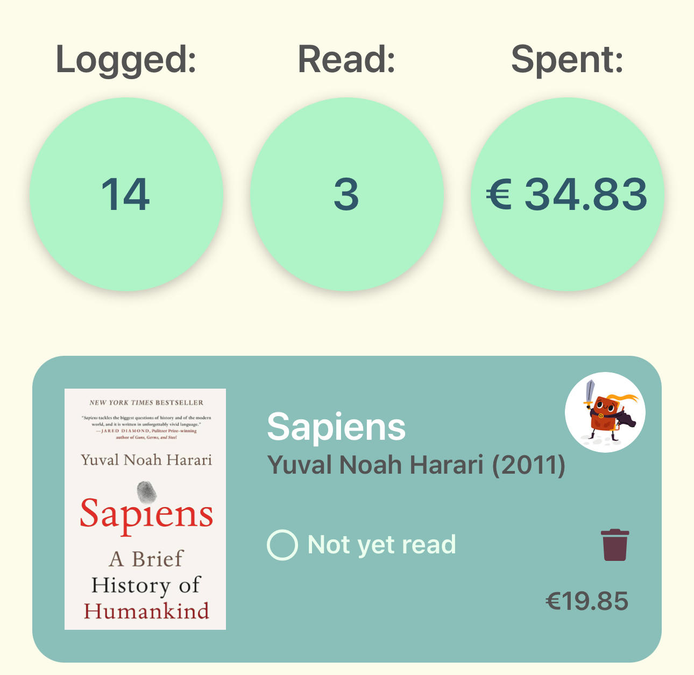

[< Volver al README](../README.md)

# Manejo de eliminación y actualización de estado de libros en la lista

## Índice

1. [Uso de BookContext](#1-uso-de-bookcontext)
2. [Eliminación de libros](#2-eliminación-de-libros)
3. [Cambio de estado de lectura](#3-cambio-de-estado-de-lectura)
4. [Actualización de contadores](#4-actualización-de-contadores)
5. [Propagación de funciones](#5-propagación-de-funciones)
6. [Sincronización dinámica](#6-sincronización-dinámica)
7. [Interfaces relacionadas](#7-interfaces-relacionadas)

## 1. **Uso de BookContext**

En la implementación final, se ha utilizado `BookContext` para centralizar la gestión de los libros. Esto permite que las funciones `deleteBook` y `toggleReadStatus` estén disponibles globalmente en toda la aplicación, eliminando la necesidad de pasarlas manualmente entre componentes.

- **Ventajas del uso de `BookContext`**:
  - Centralización del estado de los libros.
  - Simplificación de la propagación de funciones.
  - Mejor legibilidad y mantenimiento del código.

El contexto se define en el archivo `/context/BookContext.tsx` y proporciona las funciones necesarias para gestionar los libros.

## 2. **Eliminación de libros**

- **Función `deleteBook`**:

  - Ahora se gestiona directamente desde el `BookContext`.
  - Recibe como parámetro el `id` del libro a eliminar.
  - Utiliza el método `setBooks` para actualizar el estado global de los libros, filtrando aquellos cuyo `id` no coincida con el proporcionado.

  Desde la interfaz del usuario, puede acceder a esta acción haciendo clic en el icono de la basura en el libro que deseas eliminar. Una vez pulsado, se abrirá un modal de confirmación.

  |  |  |  |
  | :----------------------------------------------------------------: | :---------------------------------------------------------------------------: | :----------------------------------------------------------------------------: |
  |                           Estado inicial                           |                          Confirmación de eliminación                          |                                  Estado final                                  |

## 3. **Cambio de estado de lectura**

- **Función `toggleReadStatus`**:

  - También gestionada desde el `BookContext`.
  - Recibe el `id` del libro cuyo estado de lectura se desea alternar.
  - Utiliza `setBooks` para recorrer la lista de libros y, si el `id` coincide, invierte el valor de la propiedad `isRead` del libro correspondiente.

  El usuario puede manejar el estado haciendo clic en el icono del círculo o del check, al lado del texto "Not yet read / Aún no leído" o "Already read / Ya leído".

  |  |  |
  | :-------------------------------------------------: | :------------------------------------------: |
  |                      Sin leer                       |                    Leído                     |

## 4. **Actualización de contadores**

- Los contadores se gestionan en el componente `CounterRow`, que recibe la lista de libros actualizada desde el `BookContext`.
- **Cálculo de contadores**:
  - **Total de libros (`Logged`)**: Se calcula como la longitud de la lista de libros.
  - **Libros leídos (`Read`)**: Se filtran los libros cuyo estado `isRead` sea `true` y se cuenta su cantidad.
  - **Gasto total en libros leídos (`Spent`)**: Se filtran los libros leídos y se suman sus precios, formateando el resultado como una cadena con dos decimales.

## 5. **Propagación de funciones**

- Gracias al uso de `BookContext`, las funciones `deleteBook` y `toggleReadStatus` ya no necesitan ser propagadas manualmente entre componentes.
- Los componentes `BookList` y `Book` acceden directamente al contexto para invocar estas funciones.

## 6. **Sincronización dinámica**

- El uso de `BookContext` asegura que cualquier cambio en la lista de libros (ya sea eliminación o actualización de estado) se refleje automáticamente en toda la aplicación.
- Esto incluye la actualización de los contadores y la interfaz de usuario, manteniendo un estado consistente y actualizado.

## 7. **Interfaces relacionadas**

Para la implementación de `BookContext`, se han definido interfaces específicas en los siguientes ficheros:

- **`/types/book.ts`**:

  - `BookContextType`: Define las funciones y propiedades disponibles en el contexto.
  - `BookProps` y `BookListProps`: Se utilizan para tipar los componentes relacionados con los libros.

Estas interfaces aseguran un tipado estricto y facilitan la comunicación entre componentes, manteniendo el código modular y escalable.

[< Volver al README](../README.md)
