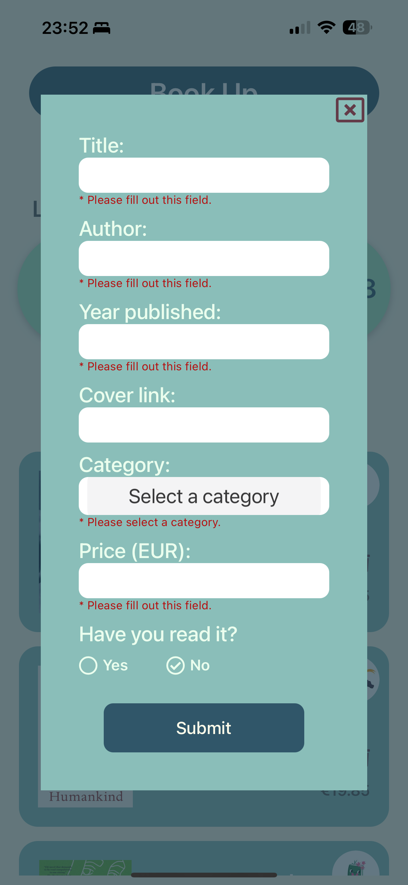
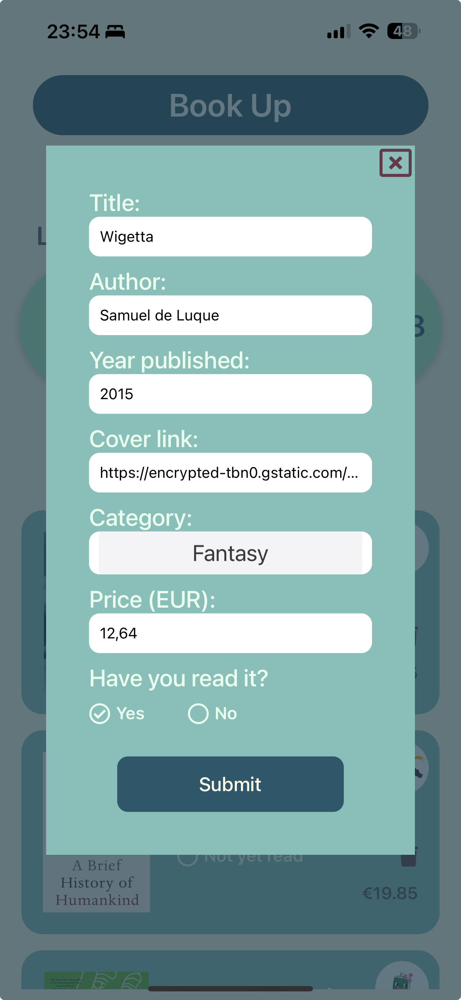
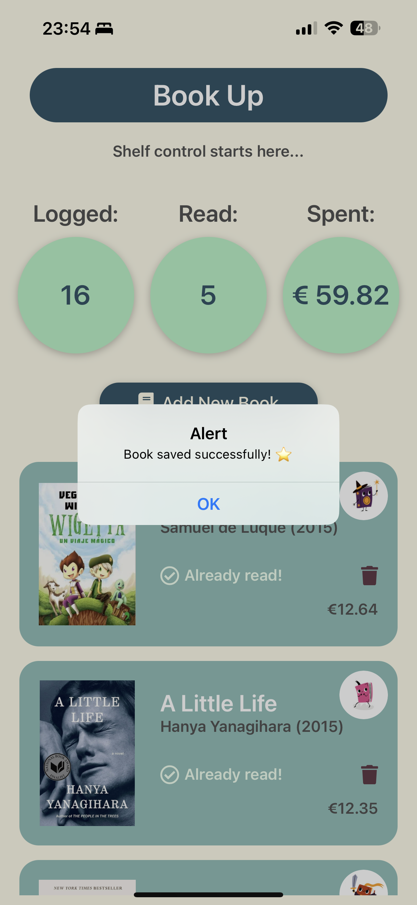
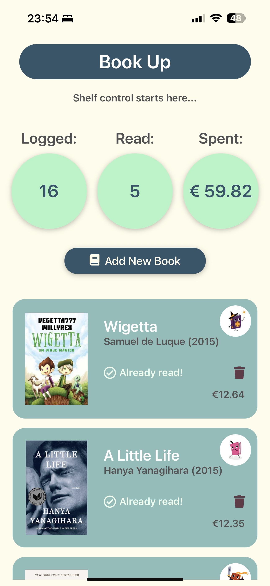

[< Volver al README](../README.md)

# Modal con formulario para la creación de libros

## Índice

1. [Descripción general](#1-descripción-general)
2. [Estructura del formulario](#2-estructura-del-formulario)
3. [Validaciones del formulario](#3-validaciones-del-formulario)
4. [Uso del Picker para la categoría](#4-uso-del-picker-para-la-categoría)
5. [Uso de BookContext](#5-uso-de-bookcontext)
6. [Actualización dinámica de la lista](#6-actualización-dinámica-de-la-lista)

## 1. **Descripción general**

El modal implementado en la aplicación permite a los usuarios agregar nuevos libros a la lista. Este modal incluye un formulario con campos para ingresar detalles del libro, como el título, autor, año de publicación, categoría, precio, y si el libro ha sido leído o no.

El diseño del modal asegura una experiencia de usuario intuitiva, con validaciones en tiempo real para garantizar que los datos ingresados sean correctos antes de guardar el libro.

## Ejemplo visual del modal

|  |  |  |
| :----------------------------------------------------------: | :--------------------------------------------------------------: | :---------------------------------------------------------: |
|                       Formulario vacío                       |                  Formulario con datos inválidos                  |                 Formulario con datos válido                 |

Con esta implementación, el modal proporciona una forma eficiente y amigable de agregar nuevos libros a la lista, asegurando que los datos sean válidos y que la lista se actualice dinámicamente.

Cuando los datos introducidos pasan las [validaciones](#3-validaciones-del-formulario), se ven las siguientes pantallas:

|  |  |
| :------------------------------------------------------------------: | :---------------------------------------------------------------: |
|                       Alerta de libro añadido                        |                         Lista actualizada                         |

## 2. **Estructura del formulario**

El formulario incluye los siguientes campos:

| Campo                  | Tipo de entrada        | Descripción                                                                 |
| ---------------------- | ---------------------- | --------------------------------------------------------------------------- |
| **Título**             | `TextInput`            | Campo obligatorio para ingresar el título del libro.                        |
| **Autor**              | `TextInput`            | Campo obligatorio para ingresar el autor del libro.                         |
| **Año de publicación** | `TextInput` (numérico) | Campo obligatorio para ingresar el año de publicación del libro.            |
| **Portada (URL)**      | `TextInput`            | Campo opcional para ingresar un enlace a la imagen de la portada del libro. |
| **Categoría**          | `Picker`               | Selector desplegable para elegir la categoría del libro.                    |
| **Precio**             | `TextInput` (numérico) | Campo obligatorio para ingresar el precio del libro.                        |
| **¿Leído?**            | `RadioButton`          | Selector para indicar si el libro ha sido leído o no.                       |

El formulario incluye un botón de envío que valida los datos y guarda el libro en la lista si todos los campos son válidos.

## 3. **Validaciones del formulario**

Se implementaron validaciones para garantizar que los datos ingresados sean correctos:

- **Título y Autor**:

  - Deben ser cadenas no vacías.
  - Se muestra un mensaje de error si el campo está vacío.

- **Año de publicación**:

  - Debe ser un número entero positivo.
  - No puede ser mayor al año actual.
  - Se muestra un mensaje de error si el valor es inválido.

- **Categoría**:

  - Es obligatorio seleccionar una categoría.
  - Se muestra un mensaje de error si no se selecciona ninguna.

- **Precio**:

  - Debe ser un número positivo con un máximo de dos decimales.
  - Se normaliza para aceptar tanto puntos como comas como separadores decimales.
  - Se muestra un mensaje de error si el valor es inválido.

- **Portada (URL)**:
  - Es opcional, pero si se proporciona, debe ser una URL válida.
  - Si no se proporciona o la URL es inválida, se utiliza una imagen por defecto.

Estas validaciones aseguran que los datos ingresados sean consistentes y evitan errores al guardar el libro.

## 4. **Uso del Picker para la categoría**

El campo de categoría utiliza el componente `Picker` de React Native para mostrar un selector desplegable con las categorías disponibles. Este componente se importa desde la dependencia `@react-native-picker/picker`.

- **Opciones**:

  - Las categorías se definen en el enumerado `Category`.
  - Cada categoría está vinculada a una imagen representativa.

- **Funcionamiento**:
  - El usuario selecciona una categoría de la lista desplegable.
  - Si no se selecciona ninguna categoría, se muestra un mensaje de error.

El uso de `Picker` mejora la experiencia del usuario al proporcionar una lista clara y fácil de usar para seleccionar la categoría.

## 5. **Uso de BookContext**

En este paso, se implementó el uso de `BookContext` para gestionar la creación de libros.

- **Función `addBook`**:
  - Se utiliza para agregar un nuevo libro a la lista global de libros.
  - Recibe un objeto `BookType` con los detalles del libro.
  - Actualiza el estado global de los libros, asegurando que el nuevo libro se refleje en toda la aplicación.

El uso de `BookContext` elimina la necesidad de pasar funciones manualmente entre componentes, simplificando la arquitectura de la aplicación.

## 6. **Actualización dinámica de la lista**

Cuando se guarda un nuevo libro, la lista de libros se actualiza automáticamente gracias al uso de `BookContext`.

- **Flujo**:
  1. El usuario completa el formulario y presiona el botón de envío.
  2. Se validan los datos ingresados.
  3. Si los datos son válidos, se llama a la función `addBook` del contexto.
  4. El nuevo libro se agrega a la lista global de libros.
  5. La interfaz de usuario se actualiza automáticamente para reflejar el nuevo libro.

Este enfoque asegura que la lista de libros esté siempre sincronizada con los datos globales, proporcionando una experiencia de usuario fluida y consistente.

[< Volver al README](../README.md)
