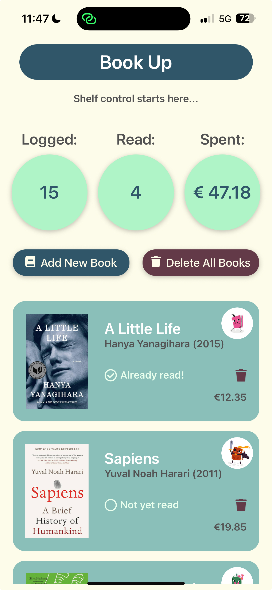
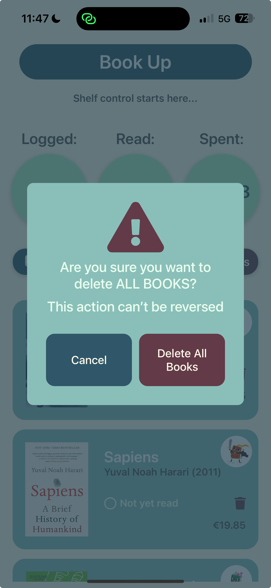
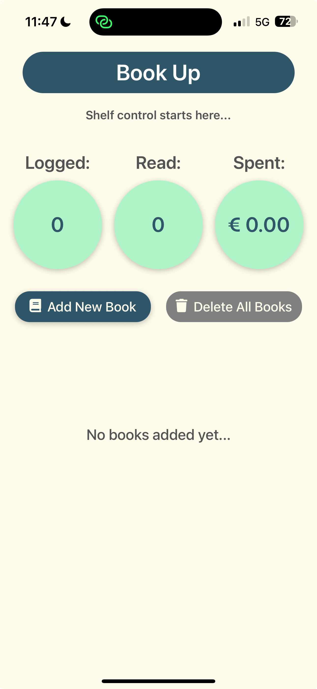

[< Volver al README](../README.md)

# Implementación del botón "Eliminar toda la lista"

## Descripción

Se ha implementado un botón que permite eliminar todos los libros de la lista de manera sencilla. Esta funcionalidad es útil para restablecer la lista o eliminar todos los datos de una sola vez. Además, se ha añadido un modal de confirmación para evitar eliminaciones accidentales. El botón se desactiva automáticamente si no hay libros en la lista.

## Pasos de implementación

### 1. Modificación del contexto `BookContext`

En el archivo del contexto `BookContext`, se añadió una nueva función llamada `deleteAllBooks`. Esta función actualiza el estado de los libros para que sea una lista vacía.

```tsx
const deleteAllBooks = () => {
  setBooks([]);
};
```

### 2. Creación del modal de confirmación

Se refactorizó el componente que anteriormente mostraba únicamente la confirmación de eliminación de un único libro, creando un componente reutilizable llamado `ConfirmationModal` que muestra un cuadro de diálogo con un mensaje, botones de confirmación y cancelación. Este modal se utiliza para confirmar la eliminación de todos los libros con `DeleteListConfirmation` y un único libro con `DeleteBookConfirmation`.

#### Componente `DeleteListConfirmation`

Se creó un componente específico para el caso de eliminar todos los libros, utilizando el modal genérico `ConfirmationModal`.

```tsx
<ConfirmationModal
  visible={visible}
  iconColor={colors.delete}
  message="Are you sure you want to delete ALL BOOKS?"
  subMessage="This action can’t be reversed"
  confirmText="Delete All Books"
  onCancel={onCancel}
  onConfirm={onDelete}
/>
```

### 3. Desactivación del botón si no hay libros

En la pantalla principal, se añadió lógica para desactivar el botón "Eliminar toda la lista" si no hay libros en la lista. Esto se logra verificando el estado de los libros desde el contexto `BookContext`.

```tsx
const isDeleteDisabled = books.length === 0;

<Pressable
  style={[styles.deleteButton, isDeleteDisabled && styles.deleteButtonDisabled]}
  onPress={() => setIsModalVisible(true)}
  disabled={isDeleteDisabled}
>
  <FontAwesome5 name="trash" size={20} style={typography.button} />
  <Text style={typography.button}>Delete All Books</Text>
</Pressable>;
```

### 4. Integración del modal en la interfaz

Cuando hay libros y el usuario presiona el botón, se muestra el modal para confirmar la acción. Si el usuario confirma la acción, todos los libros se eliminan de la lista y la interfaz se actualiza para reflejar el cambio.

El botón se desactiva automáticamente si no hay libros en la lista, y su estilo cambia para indicar que no está disponible.

## Resultado esperado

- **Con libros en la lista:** El botón "Eliminar toda la lista" está habilitado y permite al usuario eliminar todos los libros tras confirmar la acción en el modal.
- **Sin libros en la lista:** El botón "Eliminar toda la lista" está desactivado y no se puede presionar.

|  |  |  |
| :-----------------------------------------------------------------: | :----------------------------------------------------------------------: | :-----------------------------------------------------------------------: |
|                     Botón habilitado con libros                     |                          Modal de confirmación                           |                      Botón deshabilitado sin libros                       |

[< Volver al README](../README.md)
